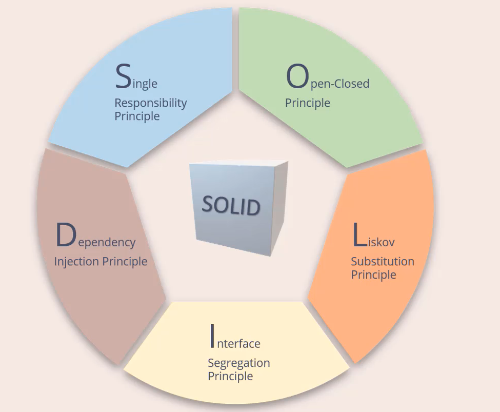

### Vocabulary

**Cohesion**: is the degree to witch the various parts of a software component are related. 
**Coupling**: is defined as the level of inter dependency between various software components. 

<a href="single-responsability-principle.md">Single Responsability Principle</a>  
<a href="open-closed-principle.md">Open-Closed Principle</a>  
<a href="liskov-substitution-principle.md">Liskov Substitution Principle</a>  
